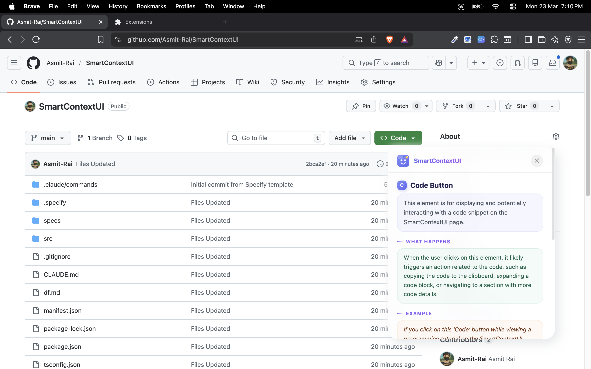
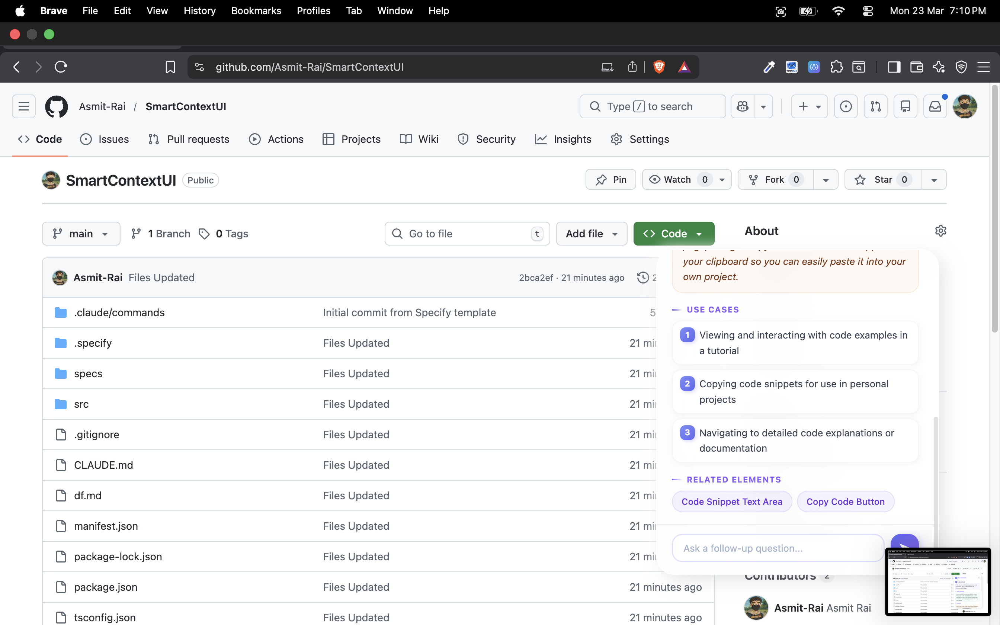
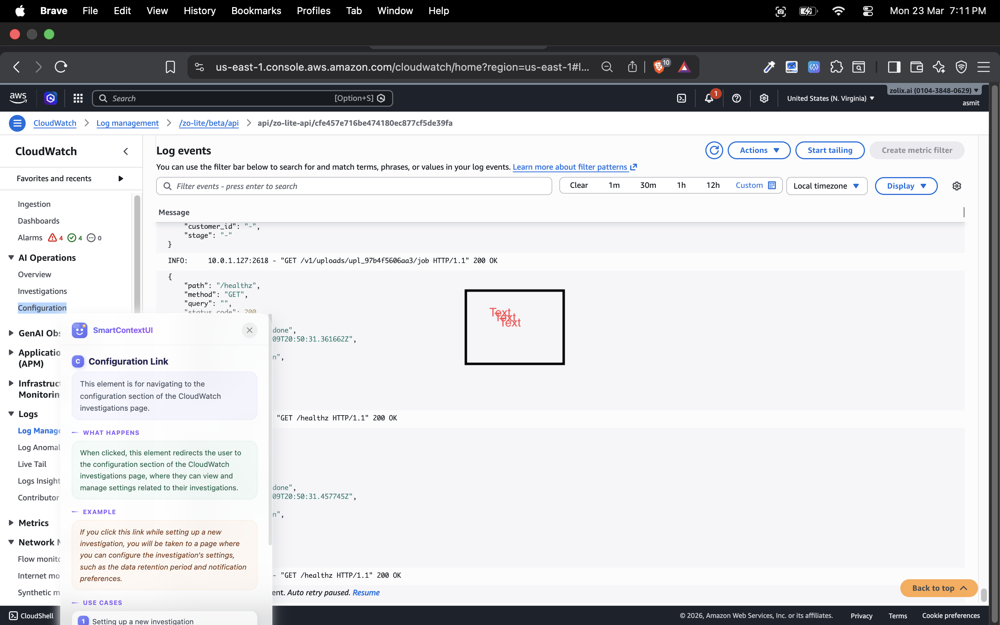
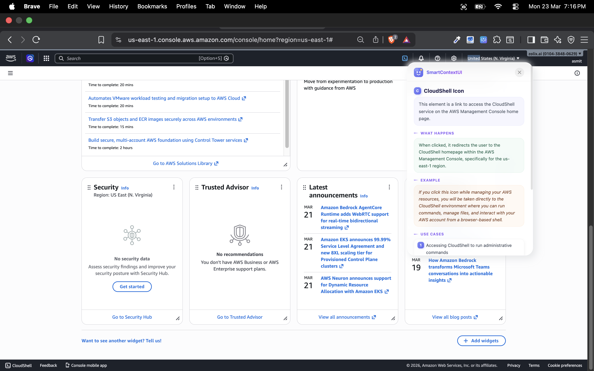

<div align="center">


# SmartContextUI

**Right-click any button, link, or input on any website — and instantly understand what it does.**

[](manifest.json)
[](https://developer.chrome.com/docs/extensions/mv3/)
[](https://vitejs.dev)
[](https://www.typescriptlang.org)
[](https://build.nvidia.com)

</div>

---

## What is SmartContextUI?

Have you ever landed on an unfamiliar website and stared at a button wondering _"what does this actually do?"_

**SmartContextUI** is a Chrome extension that answers that question instantly. Just right-click any element on any webpage — a button, a link, a form field, a menu item — and it tells you:

- **What the element is** — a clear, plain-English name
- **What it's for** — one sentence that cuts straight to the point
- **What happens when you click it** — exactly what the page will do next
- **A real example** — a concrete scenario so you really get it
- **Common use cases** — when and why people use it
- **Related elements** — what's nearby and connected

And once you get the explanation, you can **keep chatting** — ask follow-up questions and get answers right in the same panel, without leaving the page.

---

## See It In Action

**On GitHub — right-click the Code button:**



<br/>

**Scroll through the full explanation with use cases:**



<br/>

**Works everywhere — even on AWS CloudWatch:**



<br/>

**Works on the AWS Console dashboard too:**



---

## How to Load the Extension

> You don't need to publish to the Chrome Web Store to use this. You can load it directly from your computer in under a minute.

### Step 1 — Build the extension

Make sure you have [Node.js](https://nodejs.org) installed, then run:

```bash
# Clone the repo
git clone https://github.com/Asmit-Rai/SmartContextUI.git
cd SmartContextUI

# Install dependencies
npm install
```

### Step 2 — Add your API key

Create a `.env` file in the root of the project:

```bash
VITE_NVIDIA_API_KEY=your-nvapi-key-here
VITE_NVIDIA_MODEL=meta/llama-3.3-70b-instruct
```

> Get a free API key at [build.nvidia.com](https://build.nvidia.com). It's free to sign up.

### Step 3 — Build

```bash
npm run build
```

This creates a `dist/` folder — that's your extension.

### Step 4 — Load in Chrome

1. Open Chrome and go to `chrome://extensions`
2. Turn on **Developer mode** (toggle in the top-right corner)
3. Click **Load unpacked**
4. Select the `dist/` folder inside this project

That's it. The SmartContextUI icon will appear in your Chrome toolbar.

---

## How to Use It

1. Go to **any website**
2. **Right-click** any element — a button, link, input field, icon, anything
3. Click **SmartContextUI** in the right-click menu
4. A panel slides in with the full explanation
5. Want to know more? **Type a follow-up question** at the bottom and hit Enter
6. Press **Escape** or click the ✕ to close

That's the whole thing. No accounts, no dashboards, no setup beyond the API key.

---

## Features

| Feature | Details |
|---|---|
| Works on any website | GitHub, AWS, Figma, Gmail, anywhere |
| Instant explanations | Powered by Llama 3.3 70B via NVIDIA NIM |
| Real examples | Not generic — specific to the page you're on |
| Follow-up chat | Ask questions and get answers in the same panel |
| Smart caching | Same element? Instant response from cache |
| Privacy-first | No data sent except the element's visible attributes |
| Shadow DOM UI | The panel never breaks the page's own styles |

---

## Project Structure

```
SmartContextUI/
├── src/
│   ├── background/
│   │   ├── service-worker.ts   # Handles context menu, message routing
│   │   └── api-client.ts       # NVIDIA NIM API calls
│   ├── content/
│   │   ├── index.ts            # Listens for right-click trigger
│   │   ├── extractor.ts        # Pulls context from the DOM element
│   │   ├── tooltip.ts          # Renders the explanation panel
│   │   └── tooltip-styles.ts   # All styles (scoped via Shadow DOM)
│   ├── popup/
│   │   ├── popup.html          # Extension popup (enable/disable toggle)
│   │   └── popup.ts            # Popup logic
│   ├── shared/
│   │   ├── types.ts            # TypeScript interfaces
│   │   ├── settings.ts         # chrome.storage.local helpers
│   │   ├── cache.ts            # 24-hour explanation cache
│   │   └── constants.ts        # Shared constants
│   └── assets/                 # Icons and screenshots
├── dist/                       # Built extension (load this into Chrome)
├── manifest.json               # Chrome extension manifest (MV3)
├── vite.config.ts              # Vite + @crxjs build config
└── .env                        # Your API key (never committed)
```

---

## Tech Stack

| Layer | Technology |
|---|---|
| Language | TypeScript 5.x (strict mode) |
| Build tool | Vite 6.x |
| Chrome integration | @crxjs/vite-plugin (Manifest V3) |
| AI model | Llama 3.3 70B via NVIDIA NIM API |
| Storage | chrome.storage.local |
| UI isolation | Shadow DOM (closed mode) |

---

## Rebuilding After Changes

Any time you edit the code or change your `.env`:

```bash
npm run build
```

Then go to `chrome://extensions` and click the **reload icon** on the SmartContextUI card.

---

## Privacy

SmartContextUI only reads the **visible attributes** of the element you right-clicked — things like its tag name, text, placeholder, and aria label. It never reads passwords, form values you've typed, cookies, or page content you didn't interact with. The only network call is to the NVIDIA NIM API with those attributes.

---

## License

MIT — use it, fork it, build on it.

---

<div align="center">

Made with curiosity and too many browser tabs open.

**[⭐ Star this repo](https://github.com/Asmit-Rai/SmartContextUI)** if SmartContextUI saved you from clicking something you weren't sure about.

</div>
